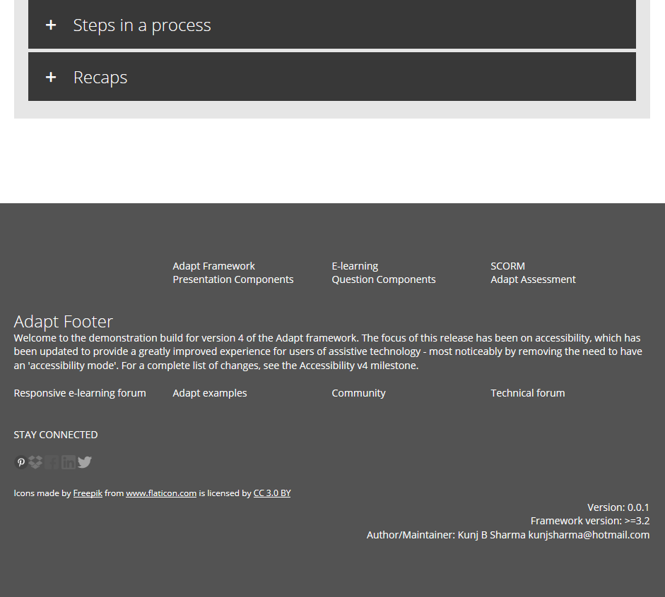

# adapt-footer  



An Adapt framework extension that adds footer under the pages.

## Installation

First, be sure to install the [Adapt Command Line Interface](https://github.com/cajones/adapt-cli), then from the command line run:

    adapt install footer

Or, download the ZIP and extract into the src > extensions directory and run an appropriate Grunt task.

### Demo

https://kunjsharma.github.io

### Usage

Add `_footer` in course.json:

```
"_footer": {
    "_isEnabled": true,
    "_items": [
	{
	    "_titles": [
		{
		    "title": "&nbsp;"
		},
		{
		    "title": "Adapt Framework"
		},
		{
		    "title": "E-learning"
		},
		{
		    "title": "SCORM"
		}
	    ]
	},
	{
	    "_titles": [
		{
		    "title": "Presentation Components"
		},
		{
		    "title": "Question Components"
		}
	    ]
	},
	{
	    "_titles": [
		{
		    "title": "<span class='large'>Adapt Footer</span>"
		}
	    ]
	}
    ]
}
```

### Limitations

Developed for framework, not tested compatiblity with authoring tool.

### Browser/platform specification

Intended to develop standard Adapt browser/devices specification.

----------------------------
**Version:**  3.0.0  
**Framework version:** 5.0.0   
**Author/maintainer:** Kunj <kunjsharma@hotmail.com>